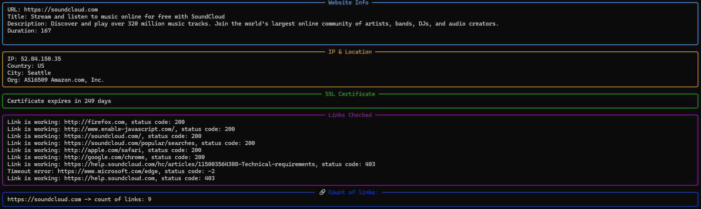
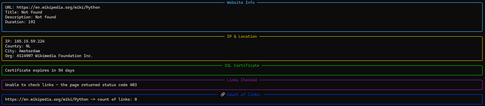

# Website Analyzer

A command-line tool that takes a website URL and returns detailed statistics about it — from server info and SSL certificate status to link health checks.

## Features

- **Website info** — retrieves the page title, meta description, and response time (ping) for the target URL.
- **IP & Geolocation** — resolves the domain to its IP address and looks up the server's country, city, and hosting organization.
- **SSL Certificate check** — verifies whether the site uses HTTPS and reports how many days remain until the SSL certificate expires.
- **Link analysis** — extracts all unique links found on the page and checks each one concurrently to detect broken or unreachable links.
- **Concurrent network requests** — built with `asyncio` and `aiohttp` to check multiple links and endpoints in parallel rather than one at a time, significantly speeding up the analysis.

Note: some websites (e.g., Wikipedia) block automated requests and will return a 403 status, which the tool detects and reports clearly.
## Technologies

- Python 3
- `aiohttp` — asynchronous HTTP requests
- `BeautifulSoup4` — HTML parsing
- `rich` — styled terminal output
- `asyncio` — concurrent task execution

## Installation

```bash
git clone https://github.com/yourusername/website-analyzer-cli.git
cd website-analyzer-cli
python -m venv .venv
.venv\Scripts\activate      # Windows
pip install -r requirements.txt
```

## Usage

```bash
python main.py <url>
```

Example:
```bash
python main.py https://example.com
```

If the URL doesn't include `http://` or `https://`, the tool will automatically add `https://`.

## Example Output

**Successful analysis** — full report including website info, IP/geolocation, SSL certificate, and link check:



**Blocked request** — some websites (like Wikipedia) block automated requests and return a `403 Forbidden` status:

